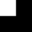

<picture>
  <source media="(prefers-color-scheme: dark)" srcset="../assets/logo-light.svg">
  
</picture>

 

# small studio

**open source software**

Apps, libraries, and tools. Mostly .NET. All of it open source.

---

A hidden file in Unix. `ls` won't show it. `ls -la` will.

We sit at the bottom layer of every product we ship.

---

## Projects

### Apps

- [re.password](https://github.com/dot-stbl/re.password) — password manager
- [plexor](https://github.com/dot-stbl/plexor) — self-hosted cloud platform
- [anlytra](https://github.com/dot-stbl/anlytra) — crypto analytics for algo traders

### Libraries & tools

- [notifliwy](https://github.com/dot-stbl/notifliwy) — distributed notifications for .NET
- [cyclex](https://github.com/dot-stbl/cyclex) — task scheduler
- [synaptix.packages](https://github.com/dot-stbl/synaptix.packages) — shared .NET utilities
- [kubix](https://github.com/dot-stbl/kubix) — TBD

### Meta

- [brand](https://github.com/dot-stbl/brand) — design rules, assets, templates

---

pure B&W · monospace only